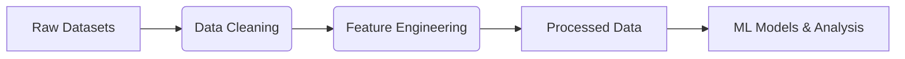

# 🕵️📈 Customer Behavior Analysis & Recommendation System 

**Unlock Insights, Drive Sales:** A smart analytics tool to understand customer behavior and deliver personalized recommendations using AI/ML.

  
*Project Homepage — Your gateway to data-driven insights!*

---

## ✨ Key Features

### 🏠 **Interactive Dashboard**
- Visualize trends, sales performance, and customer demographics in real-time.

### 🌐 **Live Review Analysis**
- Enter a product URL to analyze customer sentiments and ratings instantly.  


### 🛒 **Purchase History Explorer**
- Track individual customer purchase patterns and loyalty metrics.  


### 📊 **Customer Insights & Visualizations**
- Explore dynamic charts for product popularity, sales trends, and regional performance.  


### � **AI-Powered Recommendations**
- Generate personalized product suggestions based on user behavior and preferences.

---

## 🗃️ Datasets 

### 📂 Raw Datasets  
| File | Description |  
|------|-------------|  
| `Amazon_reviews.csv` | Customer reviews, ratings, and sentiment data for products. |  
| `ecommerce_customer_data_custom_ratios.csv` | Transaction logs with customer demographics and purchase ratios. |  
| `ecommerce_customer_data_large.csv` | Expanded dataset for customer segmentation and behavior analysis. |  
| `Online Retail.csv` | Historical sales data with product IDs, quantities, and timestamps. |  
| `online_retail_sale.csv` | Additional sales records for trend analysis and forecasting. |  

### 🔧 Processed Datasets  
| File | Purpose |  
|------|---------|  
| `processed_customer_data.csv` | Cleaned data with engineered features (e.g., customer lifetime value, purchase frequency). |  
| `unified_customer_data.csv` | Aggregated dataset for model training (combines reviews, transactions, and demographics). |  

**Data Pipeline:**  

*Processed datasets power the recommendation engine and behavioral insights.*

---

## ⚙️ Optimization & Processing
- **Preprocessing:** Merged and standardized data from 5 raw files into 2 optimized datasets.
- **ML Integration:** Trained models on processed data for accurate behavior prediction and recommendations.

---

## 🛠️ Setup & Installation

1. **Clone the repository:**
   ```bash
   git clone https://github.com/your-username/customer-behavior-analysis.git
   ```
2. **Install dependencies:**
   ```bash
   pip install pandas numpy matplotlib seaborn scikit-learn streamlit nltk
   ```
3. **Run the app:**
   ```bash
   streamlit run app.py
   ```

---

## 📈 Results & Impact
- **Customer Segmentation:** Identify high-value customers and target demographics.
- **Sales Trends:** Uncover seasonal patterns and top-selling products.
- **Personalization:** Boost engagement with tailored recommendations.

---

## 🤝 Contributing
Contributions are welcome! Open an issue or submit a PR for improvements.  
*Ensure datasets are preprocessed and models are retrained for consistency.*
